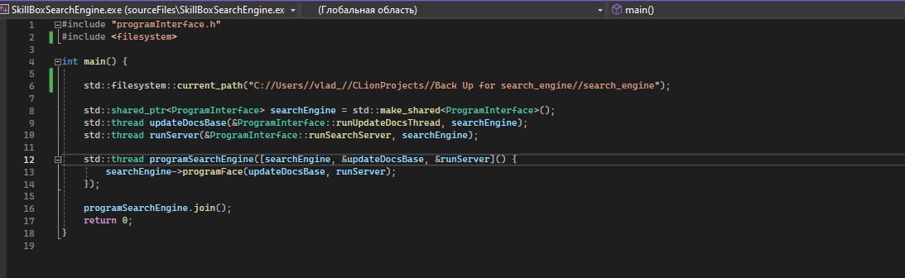
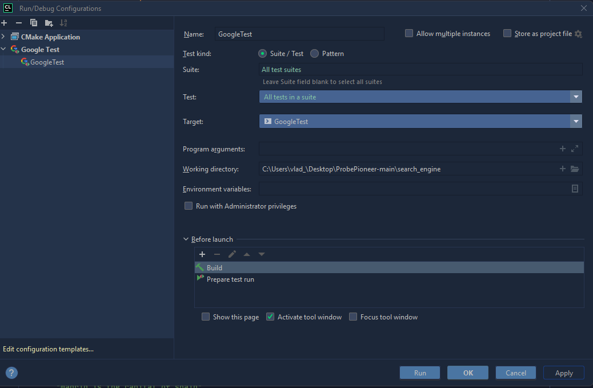
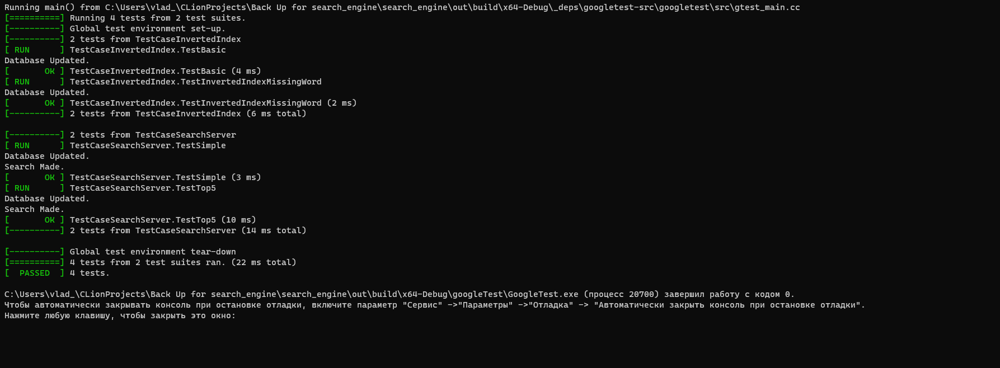
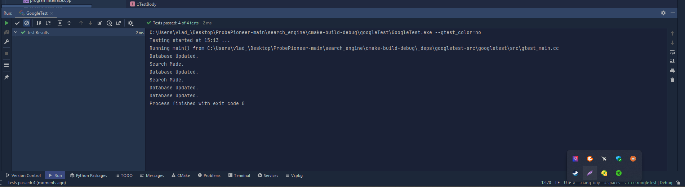

# Simple Search Engine
A local file search engine.

This project is a local search engine written in C++. It is designed to scan and index files on your computer for subsequent searching and extraction of information from them.

## Description

This program consists of four distinct classes, each having its own header and executable file. The classes are organized as follows:

ConverterJSON - converterJson.h and converterJson.cpp
## ConverterJSON Class functionalities:
The `ConverterJSON` class manages JSON file operations and data extraction required for the program's functionality.

### Methods:
- **getTextDocuments():** Reads and retrieves text documents listed in `config.json`, ensuring the correct application version, and returns a vector of documents.
- **getResponsesLimit():** Retrieves the maximum number of responses allowed based on `max_responses` from `config.json`.
- **getRequests():** Retrieves requests from `requests.json` for further processing, returning a vector of requests.
- **convertToPairVector(const std::vector<std::vector<RelativeIndex>>& input):** Converts input data into a vector of pairs, used for generating responses.
- **putAnswers(std::vector<std::vector<std::pair<size_t, double>>>& answers):** Processes search results and stores them in `answers.json`, considering response limits and the relevance of search results.
- **programName():** Retrieves the program's name from `config.json`.
- **getUpdateTime():** Retrieves the update time of the database from `config.json`.
- **addFileToConfig(const std::string& filePath):** Adds a file path to `config.json` for future document processing.
- **addRequest(const std::string& request):** Adds a request to `requests.json` for subsequent search operations.

### Usage in Main Function:
The methods within the `ConverterJSON` class are utilized in various sections of the program's main functionality. These include reading documents, managing queries, handling search responses, and updating configuration files for future operations.

InvertedIndex - invertedIndex.h.h and invertedIndex.h.cpp
## InvertedIndex Class functionalities:
The `InvertedIndex` class manages the creation and update of an inverted index structure, facilitating document processing and word frequency tracking.

### Methods:
- **count(const std::vector<std::string>& vec, const std::string& str):** Counts the occurrences of a specific word within a vector of strings.
- **processDocument(const size_t& docId):** Processes individual documents, extracting words and updating the frequency dictionary with word occurrences and respective document IDs.
- **updateDocumentBase():** Updates the document base by retrieving text documents through the `ConverterJSON` class, processing each document in parallel using multiple threads, and updating the frequency dictionary accordingly.
- **getWordCount(const std::string& word):** Retrieves word counts and document IDs associated with a specific word.
- **getDictionary():** Retrieves the entire frequency dictionary containing words and their associated occurrences in documents.
### Usage in Main Function:
The `InvertedIndex` class facilitates the creation and maintenance of an inverted index, offering methods to count word occurrences, process documents for indexing, update the index with document data, and retrieve word counts and associated document IDs. This class integrates with `ConverterJSON` to manage document retrieval and indexing operations.


SearchServer - relativeIndex.h and relativeIndex.cpp
## SearchServer Class functionalities:
The `SearchServer` class manages search functionalities and calculations for query relevancy.

### Methods:
- **compareVectors(const RelativeIndex& a, const RelativeIndex& b):** Compares two `RelativeIndex` objects based on their rank for sorting purposes.
- **splitQuery(const std::string& query):** Splits a query string into individual words and returns a vector of those words.
- **getUniqueWords(const std::vector<std::string>& words):** Retrieves unique words from a given vector of strings.
- **countWords(const std::multimap<int, size_t>& toSort):** Counts the occurrences of words in documents and organizes them into a sorted data structure.
- **toCalculation(const std::map<size_t, std::vector<int>>& toCalculate):** Calculates the relevance of words in documents based on their occurrences and returns a vector of `RelativeIndex`.
- **revelanceCalc(const std::vector<RelativeIndex>& calculation):** Computes the relevance score for each document based on the frequency of query terms.
- **search(std::vector<std::string>& queries_input):** Initiates the search process by processing input queries, determining document relevancy, and returning a vector of vectors containing `RelativeIndex` instances.

### Usage in Main Function:
The `SearchServer` class orchestrates the search functionality of the system. It performs operations such as splitting queries, calculating word relevance, organizing search results based on relevancy, and presenting the final search outcomes.

ProgramInterface - programInterface.h and programInterface.cpp
## ProgramInterface Class functionalities:
The `ProgramInterface` class serves as an interface for managing various operations within the program. The interface is initialized through `main.cpp` with the inclusion of `#include "programInterface.h"`.
### Constructor
- **ProgramInterface():** Initializes various components necessary for the program's functionality, such as:
    - `converter`: Utilizes the `ConverterJSON` class to handle JSON conversions.
    - `invIndex`: Manages the inverted index through the `InvertedIndex` class.
    - `server`: Sets up the `SearchServer` for search operations based on the inverted index.
### Methods
- **runUpdateDocsThread():** Runs a thread that updates the document base used by the inverted index at regular intervals specified by `getUpdateTime()` from the `converter` object.
- **runSearchServer():** Manages another thread that handles incoming search requests (`getRequests()`) using the `server` object. It catches exceptions that might occur during the search process.
- **programFace(std::thread& t1, std::thread& t2):** Controls the program's user interface, allowing interaction with the system. Commands include:
    - `addFile`: Adds a file to the configuration by specifying its path.
    - `addReq`: Adds a request/query to the system for subsequent search operations.
    - `search`: Initiates a search operation based on the existing queries.
    - `update`: Manually triggers an update to the document base.
    - `put`: Processes and stores search results for retrieval.
### Usage
The `ProgramInterface` class is instantiated and utilized within the `main` function to initialize the program's interface and manage its functionalities. It initializes essential components and handles various operations such as file additions, query processing, search operations, and data updates, providing an interactive command-line interface for users to interact with the system.
Each class encapsulates specific functionalities and is implemented across its respective header and source files for better organization and modularity of the codebase.

## Installation

1. Clone the repository:
    ```shell
    git clone https://github.com/justVladislav/ProbePioneer.git
    ```
2. To build the project using your compiler (Visual Studio or IDE CLion), download the Project folder search_engine on your computer. If you work on VS, select the Option "Open Local folder" and choose search_engine. After building the project, add the following header to the main.cpp #include <filesystem>. And in the main function std::filesystem::current_path("the path on your PC to the project search_engine Folder"). See the screen below.


In case you work on CLion, select the Option "Open Local folder" and choose search_engine. After building the project, Open the run configuration settings:
In the top right corner, select the run/debug configuration (for instance, next to the run button). Choose "Edit Configurations..." to open the run configuration window.
In the opened window, select the run configuration (e.g., "Application"). Find the "Working directory" field.
Set your project's working directory. 


## Usage
The interface is quite simple, and you can find all the information in the description.
The main functions are launched at specific times in separate threads, which are set in config.json. Additionally, through the interface, you can manually execute necessary functions, such as adding queries or updating the document database.
When the program is launched, it displays the project name and notifies about performing core functions, such as retrieving documents from files, updating the database, and more. As mentioned earlier, the interface is quite simple and easy to understand.
### Google Test
To run Google testing, simply choose the Google Test run/debug configuration and execute. Before running the tests, please read the comments in invertedIndex.cpp within the method void InvertedIndex::updateDocumentBase, and in relativeIndex.cpp within the method std::vector<std::vector<RelativeIndex>>SearchServer::search. Also, pay attention to the comments in the checking classes within the googleTest folder. The test results are provided below:



## Project Structure
- .idea: Configuration files related to the IDE setup.
- answers.json: JSON file containing answers data.
- cmake-build-debug: Directory for CMake build in debug mode.
- cmake-build-debug-coverage: Directory for CMake build with coverage data.
- CMakeLists.txt: CMake configuration file for the project.
- config.json: JSON file containing configuration settings.
- googleTest: Directory for Google Test framework.
- includes: Directory containing project header files.
- nlohmann_json: Directory for the nlohmann JSON library.
- requests.json: JSON file containing request data.
- resources: Directory for project resources.
- sourceFiles: Directory containing source code files.

  ## Contacts/Support
  You can find my email in the Description of my profile. I'm currently exploring the capabilities of C++ and I'm open to feedback and suggestions from experts to enhance my coding skills. I appreciate any comments or guidance on improving my code and overall proficiency in C++.
