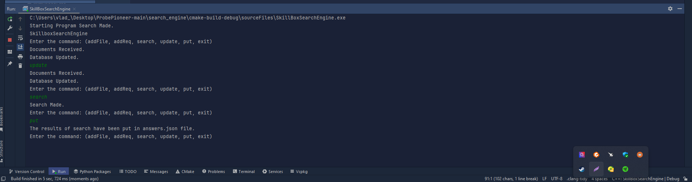

# Simple Search Engine
A local file search engine.

This project is a local search engine written in C++. It is designed to scan and index files on your computer for subsequent searching and extraction of information from them.

## Description

This program consists of four distinct classes, each having its own header and executable file. The classes are organized as follows:

ConverterJSON - converterJson.h and converterJson.cpp
## ConverterJSON Class functionalities:
The `ConverterJSON` class manages JSON file operations and data extraction required for the program's functionality.

### Methods:
- **getTextDocuments():** Reads and retrieves text documents listed in `config.json`, ensuring the correct application version, and returns a vector of documents.
- **getResponsesLimit():** Retrieves the maximum number of responses allowed based on `max_responses` from `config.json`.
- **getRequests():** Retrieves requests from `requests.json` for further processing, returning a vector of requests.
- **convertToPairVector(const std::vector<std::vector<RelativeIndex>>& input):** Converts input data into a vector of pairs, used for generating responses.
- **putAnswers(std::vector<std::vector<std::pair<size_t, double>>>& answers):** Processes search results and stores them in `answers.json`, considering response limits and the relevance of search results.
- **programName():** Retrieves the program's name from `config.json`.
- **getUpdateTime():** Retrieves the update time of the database from `config.json`.
- **addFileToConfig(const std::string& filePath):** Adds a file path to `config.json` for future document processing.
- **addRequest(const std::string& request):** Adds a request to `requests.json` for subsequent search operations.

### Usage:
The methods within the `ConverterJSON` class are utilized in various sections of the program's functionality. These include reading documents, managing queries, handling search responses, and updating configuration files for future operations.

InvertedIndex - invertedIndex.h.h and invertedIndex.h.cpp
## InvertedIndex Class functionalities:
The `InvertedIndex` class manages the creation and update of an inverted index structure, facilitating document processing and word frequency tracking.

### Methods:
- **count(const std::vector<std::string>& vec, const std::string& str):** Counts the occurrences of a specific word within a vector of strings.
- **processDocument(const size_t& docId):** Processes individual documents, extracting words and updating the frequency dictionary with word occurrences and respective document IDs.
- **updateDocumentBase():** Updates the document base by retrieving text documents through the `ConverterJSON` class, processing each document in parallel using multiple threads, and updating the frequency dictionary accordingly.
- **getWordCount(const std::string& word):** Retrieves word counts and document IDs associated with a specific word.
- **getDictionary():** Retrieves the entire frequency dictionary containing words and their associated occurrences in documents.
### Usage:
The `InvertedIndex` class facilitates the creation and maintenance of an inverted index, offering methods to count word occurrences, process documents for indexing, update the index with document data, and retrieve word counts and associated document IDs. This class integrates with `ConverterJSON` to manage document retrieval and indexing operations.

SearchServer - relativeIndex.h and relativeIndex.cpp
## SearchServer Class functionalities:
The `SearchServer` class manages search functionalities and calculations for query relevancy.

### Methods:
- **compareVectors(const RelativeIndex& a, const RelativeIndex& b):** Compares two `RelativeIndex` objects based on their rank for sorting purposes.
- **splitQuery(const std::string& query):** Splits a query string into individual words and returns a vector of those words.
- **getUniqueWords(const std::vector<std::string>& words):** Retrieves unique words from a given vector of strings.
- **countWords(const std::multimap<int, size_t>& toSort):** Counts the occurrences of words in documents and organizes them into a sorted data structure.
- **toCalculation(const std::map<size_t, std::vector<int>>& toCalculate):** Calculates the relevance of words in documents based on their occurrences and returns a vector of `RelativeIndex`.
- **revelanceCalc(const std::vector<RelativeIndex>& calculation):** Computes the relevance score for each document based on the frequency of query terms.
- **search(std::vector<std::string>& queries_input):** Initiates the search process by processing input queries, determining document relevancy, and returning a vector of vectors containing `RelativeIndex` instances.

### Usage:
The `SearchServer` class orchestrates the search functionality of the system. It performs operations such as splitting queries, calculating word relevance, organizing search results based on relevancy, and presenting the final search outcomes.

ProgramInterface - programInterface.h and programInterface.cpp
## ProgramInterface Class functionalities:
The `ProgramInterface` class serves as an interface for managing various operations within the program. The interface is initialized through `main.cpp` with the inclusion of `#include "programInterface.h"`.
### Constructor
- **ProgramInterface():** Initializes various components necessary for the program's functionality, such as:
    - `converter`: Utilizes the `ConverterJSON` class to handle JSON conversions.
    - `invIndex`: Manages the inverted index through the `InvertedIndex` class.
    - `server`: Sets up the `SearchServer` for search operations based on the inverted index.
### Methods
- **runUpdateDocsThread():** Runs a thread that updates the document base used by the inverted index at regular intervals specified by `getUpdateTime()` from the `converter` object.
- **runSearchServer():** Manages another thread that handles incoming search requests (`getRequests()`) using the `server` object. It catches exceptions that might occur during the search process.
- **programFace(std::thread& t1, std::thread& t2):** Controls the program's user interface, allowing interaction with the system. Commands include:
    - `addFile`: Adds a file to the configuration by specifying its path.
    - `addReq`: Adds a request/query to the system for subsequent search operations.
    - `search`: Initiates a search operation based on the existing queries.
    - `update`: Manually triggers an update to the document base.
    - `put`: Processes and stores search results for retrieval.
### Usage in the Main Function:
The `ProgramInterface` class is instantiated and utilized within the `main` function to initialize the program's interface and manage its functionalities. It initializes essential components and handles various operations such as file additions, query processing, search operations, and data updates, providing an interactive command-line interface for users to interact with the system.
Each class encapsulates specific functionalities and is implemented across its respective header and source files for better organization and modularity of the codebase.

## Installation
Make sure you have the following installed:
- **CMake (version 3.25 or higher)**
- **C++ Compiler supporting C++17 standard**
### Installing Dependencies
**The dependency nlohmann_json is already included in the project libraries and does not require downloading its repository separately.**
The **add_subdirectory(nlohmann_json) command** includes the existing nlohmann_json library into your project, assuming it's already part of your project's directory structure or defined in your project's CMakeLists. 
Then, **target_link_libraries associates the nlohmann_json::nlohmann_json** target with your SkillBoxSearchEngine target, enabling your project to utilize the functionalities provided by the nlohmann_json library seamlessly.
This setup avoids the need to download the nlohmann_json repository separately, assuming the library is already available within your project's structure or dependencies.

### Building the Project
1. Download the repository as zip file on your Computer and unpack the zip File.
 
2. To build the project using your compiler (Visual Studio or IDE CLion). If you work on VS, select the Option "Open Local folder" and choose search_engine. 
In case you work on CLion, select the Option "Open Local folder" and choose search_engine.
When using IDEs like Visual Studio or CLion with built-in CMake support, project building usually occurs automatically within the IDE. This is thanks to the integrated CMake support in these development tools.
Upon opening a project with CMake in a supported IDE, it detects the CMakeLists.txt files and uses them to generate the project according to the configuration specified in these files. Then, the IDE automatically performs the configuration process (generating build files) and offers the ability to build and run the project inside the development environment without needing to use the command line or input commands manually. 

### Building a Project via Terminal
To build your project using the terminal, follow these steps:

**1. Create a Build Directory:**
Open your terminal and navigate to the root directory of your project. Then, create a build directory using the following command: **mkdir build.**
This command creates a new folder. Or you can create a build directory by creating a separate folder using your OS functionalities.

**2. Move into the newly created build directory: cd <name_of_the_folder>.**
Or open a terminal or command prompt inside this folder(build directory).

**3. Once inside the build directory, execute CMake to generate the necessary build files. Replace <path_to_source> with the path to your project's source code: cmake or cmake.exe <path_to_source>.**
**Make sure that the path to the installed CMake is added to the PATH environment variable. This will allow your operating system to find the CMake executable file.**
Ex: cmake "C:\Users\vlad_\Desktop\ProbePioneer-main\search_engine\CMakeLists.txt".

**4. Once CMake generates the build files, initiate the build process using a build tool (сmake --build or msbuild). Use the following command: cmake --build <path_to_build_directory_folder>.**
Ex:  cmake --build C:\Users\vlad_\Desktop\search_engine

**5. After building the project via the terminal, move to folder with config files using the following command: cd sourceFiles.**
   
**6. The executable file is created in a separate "Debug" folder located one directory below the configuration files. You need to move the executable file to the directory above, alongside the configuration files, using the move command: move<path_to_executable_file> <path_to_source_Files>.**

   
**7. To run an executable file via the terminal, you need to use the command ./ followed by the name of the executable file: ./SkillBoxSearchEngine**

## Usage
To run the program, simply choose SkillBoxSearchEngine in run/debug configuration and execute. The interface is quite simple, and you can find all the information in the description.
The main functions are launched at specific times in separate threads, which are set in config.json. Additionally, through the interface, you can manually execute necessary functions, such as adding queries or updating the document database.
When the program is launched, it displays the project name and notifies about performing core functions, such as retrieving documents from files, updating the database, and more. As mentioned earlier, the interface is quite simple and easy to understand.

### Google Test
To run Google testing, simply choose the Google Test in run/debug configuration and execute.
The test results are provided below:

## Project Structure
- .idea: Configuration files related to the IDE setup.
- answers.json: JSON file containing answers data.
- CMakeLists.txt: CMake configuration file for the project.
- config.json: JSON file containing configuration settings.
- googleTest: Directory for Google Test framework.
- includes: Directory containing project header files.
- nlohmann_json: Directory for the nlohmann JSON library.
- requests.json: JSON file containing request data.
- resources: Directory for project resources.
- sourceFiles: Directory containing source code files.

  ## Contacts/Support
  You can find my email in the Description of my profile. I'm currently exploring the capabilities of C++ and I'm open to feedback and suggestions from experts to enhance my coding skills. I appreciate any comments or guidance on improving my code and overall proficiency in C++.
